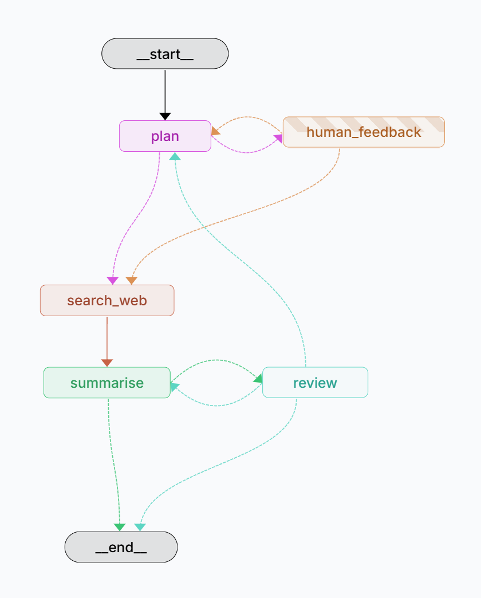

# LangGraph DeepSearch

Reproducing deep search functionality using LangGraph framework with **Closed-loop Learning System**.

> **⚠️ Development Status**: This project is currently under active development. More features and improvements will be added over time.

## 🔄 Graph Architecture



*The LangGraph workflow showing the complete search pipeline with conditional edges, human-in-the-loop feedback, and iterative refinement.*

## 🧠 Closed-loop Learning System

This project implements a **Closed-loop Learning System** that enables the agent to learn from human feedback and improve over time. The system follows three phases:

### Phase 1: Recall & Plan
1. **Input**: User submits a task/query
2. **Store Search**: Agent searches LangGraph Store for relevant past experiences
3. **Draft Plan**: Agent generates initial sub-questions (Plan A) incorporating recalled lessons

### Phase 2: Human-in-the-loop
4. **Interrupt**: Workflow pauses to show Plan A to human
5. **Human Correction**: Human reviews and optionally modifies the plan (Plan B)
6. **Execute**: Agent executes the search with the final plan

### Phase 3: Reflect & Memorize
7. **Compare**: After task completion, compare Plan A and Plan B
8. **Distill**: LLM analyzes differences and extracts actionable lessons
9. **Store**: Save new lessons to LangGraph Store for future use

**Key Benefit**: Over time, as the agent accumulates lessons, it will generate better initial plans that require less human correction!

**Technical Note**: Learning uses **LangGraph Store** (not Checkpointer) for persistent, cross-session memory. Store saves lessons globally with vector embeddings for semantic search, while Checkpointer only saves per-thread conversation state. The learn subgraph runs asynchronously after task completion to avoid blocking the main workflow.

## 📚 Why LangGraph?

- **Stateful Workflows**: Built-in state management for complex search pipelines
- **Cyclic Graphs**: Support for iterative refinement and multi-step reasoning
- **Conditional Edges**: Dynamic workflow branching based on search quality
- **Checkpointing**: Resume interrupted searches and inspect intermediate states
- **Human-in-the-Loop**: Easy integration of human feedback during search process
- **Streaming Support**: Real-time results as the search progresses
- **Composability**: Modular nodes that can be reused and recombined

## Quick Start

### Prerequisites

- Python 3.11+
- LangGraph CLI (`pip install langgraph-cli`)

### Installation

```bash
# Clone the repository
git clone https://github.com/EricKing22/LangGraph_DeepSearch.git
cd LangGraph_DeepSearch

# Install dependencies
pip install -e .

# Configure environment variables
cp .env.example .env
# Edit .env with your API keys
```

### Environment Configuration

Create a `.env` file in the project root with the following variables:

```env
# LLM Configuration (choose one or more)
OPENAI_API_KEY=your_openai_api_key
OPENAI_MODEL=gpt-4o
OPENAI_TEMPERATURE=0.7

# Search API
TAVILY_API_KEY=your_tavily_api_key

# Search Configuration
MAX_SUB_QUESTIONS=5
MAX_SEARCH_RESULTS=5
SEARCH_TIMEOUT=10
```

## Deployment & Usage

### Local Development with LangGraph Dev

The easiest way to run and test this project is using `langgraph dev`:

```bash
# Start the LangGraph development server
langgraph dev
```

This command will:
- Start a local API server (default: http://localhost:2024)
- Enable the LangGraph Studio UI for visual debugging
- Provide hot-reload for code changes
- Set up automatic checkpointing for conversation state

### Command Line Interface (CLI)

For quick searches without the development server, use the CLI directly:

#### Basic Usage

```bash
# Simple query
deepsearch --query "What is the difference between LangSmith and LangGraph?"

# Query with custom thread ID (useful for maintaining separate conversation contexts)
deepsearch --query "What are the benefits of using LangGraph?" --thread-id "conversation-123"

# Multi-word queries (quotes required)
deepsearch --query "How does quantum computing differ from classical computing?"
```

#### CLI Workflow

When you run a query via CLI, the following happens:

1. **Query Processing**: Your query is analyzed and decomposed into sub-questions
2. **Human Feedback** (Interactive): You'll be prompted to review and provide feedback on the generated sub-questions
   - Press Enter to proceed with the current questions
   - Provide feedback to refine the questions
3. **Web Search**: Each sub-question is searched using Tavily API
4. **Result Synthesis**: Results are compiled into a comprehensive answer with citations
5. **Quality Review**: The answer is automatically reviewed and scored
6. **Final Output**: Displays the complete answer with sources

#### Interactive Feedback Example

```
🔍 Processing query ...
✓ Query processed!

🤖 [plan] I'm now going to search for these topics:
**1**. What is LangSmith and what are its primary features?
**2**. What is LangGraph and what are its primary features?

💬 Please provide feedback on the sub-questions:
(Press Enter with no input to proceed as-is)

Your feedback: Add a question about pricing differences

✓ Received feedback: Add a question about pricing differences

[Processing continues with updated questions...]
```

#### Output Format

The CLI provides structured output with:
- 🔍 Processing indicator
- 🤖 Node-level outputs (shows which component is working)
- 📄 Final summary with detailed analysis
- 📚 Number of sources consulted
- Citations in IEEE reference style

#### Tips

- **Use quotes** around your query if it contains multiple words
- **Thread IDs** allow you to maintain separate conversation contexts for different topics
- **Feedback is optional** - press Enter (empty message) to skip and proceed with generated sub-questions
- **Interruption** - Press `Ctrl+C` to cancel a search in progress

### How It Works

1. **Query Extraction**: Extracts the user's query from messages
2. **Query Analysis**: Decides whether to break down the query into sub-questions
3. **Question Generation** (Optional): Creates focused sub-questions for comprehensive search
4. **Web Search**: Executes Tavily searches for each question
5. **Relevance Filtering**: Uses LLM to filter out irrelevant results
6. **Synthesis**: Generates a comprehensive answer with citations

### Features

- **Automatic State Management**: LangGraph Cloud handles checkpointing automatically
- **Multi-turn Conversations**: Each thread maintains conversation history
- **Human-in-the-Loop**: Support for human feedback during question generation
- **Iterative Refinement**: Can regenerate sub-questions based on feedback
- **Source Attribution**: Includes citations to original sources


## Troubleshooting

### Command Not Found: `langgraph`

Install the LangGraph CLI:

```bash
pip install langgraph-cli
```

### Port Already in Use

If port 2024 is already in use, specify a different port:

```bash
langgraph dev --port 8080
```

### API Key Issues

Ensure your `.env` file is properly configured

## Project Structure

```
LangGraph_DeepSearch/
├── src/
│   ├── graphs/
│   │   └── web_search_graph.py    # Main graph definition
│   ├── nodes/
│   │   ├── question_nodes.py      # Query processing and planning nodes
│   │   ├── search_nodes.py        # Web search execution nodes
│   │   ├── review_nodes.py        # Quality review and scoring nodes
│   │   └── learning_nodes.py      # Closed-loop learning nodes (recall, compare, learn)
│   ├── state/
│   │   └── states.py              # State schemas (WebSearchState, Search, etc.)
│   ├── tools/
│   │   ├── search_tool.py         # Tavily search integration
│   │   └── consult_note.py        # LangGraph Store integration for lessons
│   ├── prompts/
│   │   └── search_prompts.py      # LLM prompts for all nodes
│   ├── utils/                     # Utility functions
│   ├── cli.py                     # Command-line interface
│   ├── config.py                  # Configuration management & logging setup
│   ├── llm.py                     # LLM initialization
│   └── __init__.py                # Package initialization
├── tests/
│   ├── test_graphs.py             # Graph tests
│   ├── test_nodes.py              # Node tests
│   └── test_tools.py              # Tool tests
├── langgraph.json                 # LangGraph configuration (includes Store config)
├── .env                           # Environment variables (create from .env.example)
├── .env.example                   # Environment template
├── pyproject.toml                 # Project dependencies & metadata
├── requirements.txt               # Python dependencies
├── LICENSE                        # License file
└── README.md                      # This file
```
