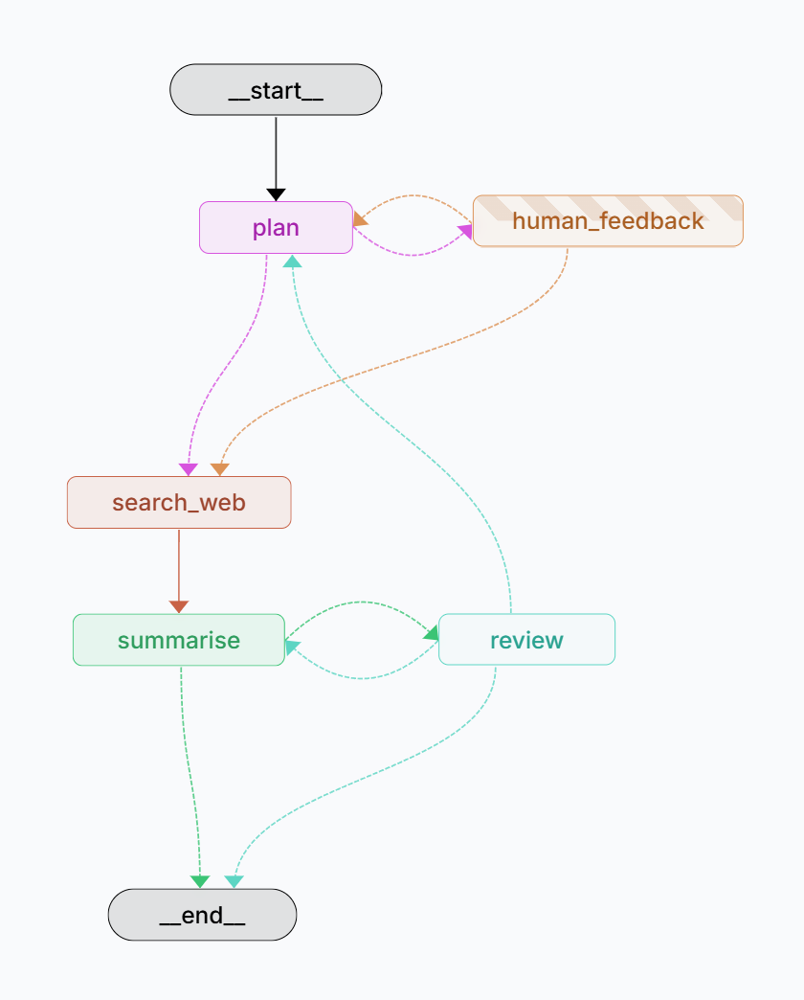

# LangGraph DeepSearch

A powerful **AI-powered deep research agent** built with LangGraph that combines **human-in-the-loop** control, **automatic quality review**, and **self-learning capabilities** to deliver high-quality research results.

> **⚠️ Development Status**: This project is currently under active development. More features and improvements will be added over time.

## 🔄 Graph Architecture



*The LangGraph workflow showing the complete search pipeline with conditional edges, human-in-the-loop feedback, and iterative refinement.*

## Key Features

### 1. 🔄 Human-in-the-Loop Control
Full control over the research process with interruptible workflows:
- **Plan Review**: Review and modify AI-generated sub-questions before execution
- **Iterative Refinement**: Provide feedback to improve search strategy
- **Transparent Decision-Making**: See exactly what the agent is planning to search for

### 2. 📊 Automatic Quality Review
Built-in quality assurance with automatic scoring:
- **Auto-Scoring**: Every summary receives a score (1-10) based on completeness and accuracy
- **Strengths/Weaknesses Analysis**: Detailed feedback on what's good and what needs improvement
- **Iterative Improvement**: Low scores trigger automatic re-generation with specific improvement focus

### 3. 🧠 Self-Learning System (Closed-loop Learning)
The agent learns from every interaction to improve over time:
- **Recall Past Experiences**: Before planning, the agent recalls relevant lessons from previous tasks
- **Compare Plan A & B**: Analyzes the difference between AI's initial plan and human-modified plan
- **Extract Actionable Lessons**: LLM distills meaningful insights from human corrections
- **Persistent Memory**: Stores lessons in LangGraph Store for cross-session learning

**Key Benefit**: Over time, as the agent accumulates lessons, it will generate better initial plans that require less human correction!

### Technical Note
Learning uses **LangGraph Store** (not Checkpointer) for persistent, cross-session memory. Store saves lessons globally with vector embeddings for semantic search, while Checkpointer only saves per-thread conversation state. The learn subgraph runs asynchronously after task completion to avoid blocking the main workflow.


### How the Three Mechanisms Work Together

1. **Before Search (Human-in-the-loop)**
   - Agent generates Plan A (initial sub-questions)
   - User reviews and modifies → Plan B
   - Execution proceeds with Plan B

2. **After Search (Review)**
   - Agent generates summary and auto-scores it
   - If score > 7: workflow completes
   - If score ≤ 7: feedback is used to improve plan

3. **After Completion (Self-Learning)**
   - Compares Plan A vs Plan B
   - LLM extracts actionable lesson
   - Lesson stored for future recall

## 📚 Why LangGraph?

- **Stateful Workflows**: Built-in state management for complex search pipelines
- **Cyclic Graphs**: Support for iterative refinement and multi-step reasoning
- **Conditional Edges**: Dynamic workflow branching based on search quality
- **Checkpointing**: Resume interrupted searches and inspect intermediate states
- **Human-in-the-Loop**: Easy integration of human feedback during search process
- **Streaming Support**: Real-time results as the search progresses
- **Composability**: Modular nodes that can be reused and recombined

## Quick Start

### Prerequisites

- Python 3.11+
- LangGraph CLI (`pip install langgraph-cli`)

### Installation

```bash
# Clone the repository
git clone https://github.com/EricKing22/LangGraph_DeepSearch.git
cd LangGraph_DeepSearch

# Install dependencies
pip install -e .

# Configure environment variables
cp .env.example .env
# Edit .env with your API keys
```

### Environment Configuration

Create a `.env` file in the project root with the following variables:

```env
# LLM Configuration (choose one or more)
OPENAI_API_KEY=your_openai_api_key
OPENAI_MODEL=gpt-4o
OPENAI_TEMPERATURE=0.7

# Search API
TAVILY_API_KEY=your_tavily_api_key

# Search Configuration
MAX_SUB_QUESTIONS=5
MAX_SEARCH_RESULTS=5
SEARCH_TIMEOUT=10
```

## Deployment & Usage

### Local Development with LangGraph Dev

The easiest way to run and test this project is using `langgraph dev`:

```bash
# Start the LangGraph development server
langgraph dev
```

This command will:
- Start a local API server (default: http://localhost:2024)
- Enable the LangGraph Studio UI for visual debugging
- Provide hot-reload for code changes
- Set up automatic checkpointing for conversation state

### Command Line Interface (CLI)

For quick searches without the development server, use the CLI directly:

#### Basic Usage

```bash
# Simple query
deepsearch --query "What is the difference between LangSmith and LangGraph?"

# Query with custom thread ID (useful for maintaining separate conversation contexts)
deepsearch --query "What are the benefits of using LangGraph?" --thread-id "conversation-123"

# Multi-word queries (quotes required)
deepsearch --query "How does quantum computing differ from classical computing?"
```

#### CLI Workflow

When you run a query via CLI, the following happens:

1. **Query Processing**: Your query is analyzed and decomposed into sub-questions
2. **Recall Past Lessons** (Self-Learning): Agent searches memory for relevant past experiences
3. **Human Feedback** (Interactive): You'll be prompted to review and provide feedback on the generated sub-questions
   - Press Enter to proceed with the current questions
   - Provide feedback to refine the questions
4. **Web Search**: Each sub-question is searched using Tavily API
5. **Result Synthesis**: Results are compiled into a comprehensive answer with citations
6. **Quality Review**: The answer is automatically reviewed and scored
   - If score ≤ 7: The workflow loops back to improve the plan
   - If score > 7: The workflow completes
7. **Self-Learning** (Async): After completion, the agent compares Plan A vs Plan B and extracts lessons
8. **Final Output**: Displays the complete answer with sources

#### Interactive Feedback Example (Human-in-the-Loop)

```
🔍 Processing query ...
✓ Query processed!

🧠 [recall] Recalled past experiences from memory:
- When researching comparison topics, always include pricing/cost aspects

🤖 [plan] I'm now going to search for these topics:
**1**. What is LangSmith and what are its primary features?
**2**. What is LangGraph and what are its primary features?

💬 Please provide feedback on the sub-questions:
(Press Enter with no input to proceed as-is)

Your feedback: Add a question about pricing differences

✓ Received feedback: Add a question about pricing differences

[Processing continues with updated questions...]
```

#### Review Feedback Example (Quality Assurance)

```
📊 [review] Quality Review:

**Score**: 6/10

**Strengths**:
- Good explanation of core concepts
- Clear comparison structure

**Weaknesses**:
- Missing pricing information
- Lacks practical use cases

[Loop back to improve with feedback...]
```

#### Output Format

The CLI provides structured output with:
- 🔍 Processing indicator
- 🤖 Node-level outputs (shows which component is working)
- 📄 Final summary with detailed analysis
- 📚 Number of sources consulted
- Citations in IEEE reference style

#### Tips

- **Use quotes** around your query if it contains multiple words
- **Thread IDs** allow you to maintain separate conversation contexts for different topics
- **Feedback is optional** - press Enter (empty message) to skip and proceed with generated sub-questions
- **Interruption** - Press `Ctrl+C` to cancel a search in progress

### How It Works

1. **Query Extraction**: Extracts the user's query from messages
2. **Query Analysis**: Decides whether to break down the query into sub-questions
3. **Question Generation** (Optional): Creates focused sub-questions for comprehensive search
4. **Web Search**: Executes Tavily searches for each question
5. **Relevance Filtering**: Uses LLM to filter out irrelevant results
6. **Synthesis**: Generates a comprehensive answer with citations

### Features

- **Human-in-the-Loop**: Full control with interruptible workflow - review and modify AI plans before execution
- **Automatic Quality Review**: Every summary is scored (1-10) with detailed feedback
- **Self-Learning**: Agent learns from every interaction and improves over time
- **Persistent Memory**: Cross-session learning using LangGraph Store
- **Iterative Refinement**: Low scores trigger automatic re-generation
- **Source Attribution**: Includes citations to original sources


## Troubleshooting

### Command Not Found: `langgraph`

Install the LangGraph CLI:

```bash
pip install langgraph-cli
```

### Port Already in Use

If port 2024 is already in use, specify a different port:

```bash
langgraph dev --port 8080
```

### API Key Issues

Ensure your `.env` file is properly configured

## Project Structure

```
LangGraph_DeepSearch/
├── src/
│   ├── graphs/
│   │   └── web_search_graph.py    # Main graph definition
│   ├── nodes/
│   │   ├── question_nodes.py      # Query processing and planning nodes
│   │   ├── search_nodes.py        # Web search execution nodes
│   │   ├── review_nodes.py        # Quality review and scoring nodes
│   │   └── learning_nodes.py      # Closed-loop learning nodes (recall, compare, learn)
│   ├── state/
│   │   └── states.py              # State schemas (WebSearchState, Search, etc.)
│   ├── tools/
│   │   ├── search_tool.py         # Tavily search integration
│   │   └── consult_note.py        # LangGraph Store integration for lessons
│   ├── prompts/
│   │   └── search_prompts.py      # LLM prompts for all nodes
│   ├── utils/                     # Utility functions
│   ├── cli.py                     # Command-line interface
│   ├── config.py                  # Configuration management & logging setup
│   ├── llm.py                     # LLM initialization
│   └── __init__.py                # Package initialization
├── tests/
│   ├── test_graphs.py             # Graph tests
│   ├── test_nodes.py              # Node tests
│   └── test_tools.py              # Tool tests
├── langgraph.json                 # LangGraph configuration (includes Store config)
├── .env                           # Environment variables (create from .env.example)
├── .env.example                   # Environment template
├── pyproject.toml                 # Project dependencies & metadata
├── requirements.txt               # Python dependencies
├── LICENSE                        # License file
└── README.md                      # This file
```
